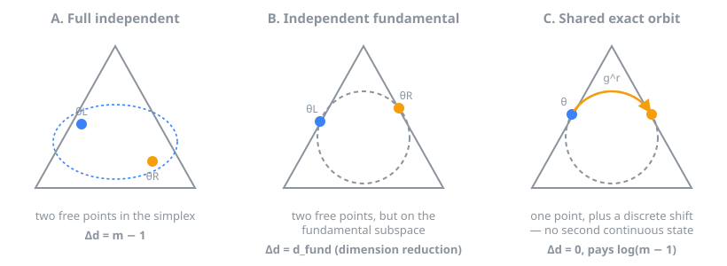
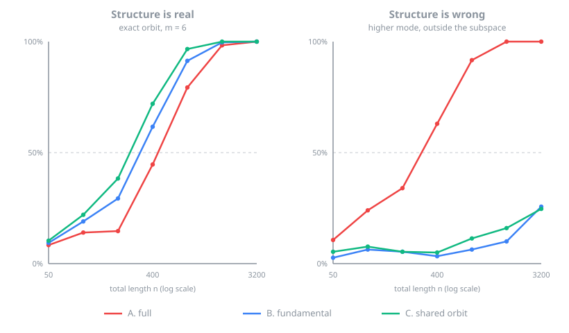

# RegimeShift

**Geometry of Regime Shifts** — reference implementation and test harness for
*Geometric Complexity in Cyclic Regime Changes: Full, Fundamental-Subspace, and
Shared-Orbit Models under Minimum Description Length* (Mac Mayo).

The manuscript is in [`docs/`](docs/), together with
[`docs/paper-notes.md`](docs/paper-notes.md), which records exactly what this
code reproduces, the deliberate deviations, and the corrections made along the
way. [`docs/related-work.md`](docs/related-work.md) maps the adjacent
literatures.

## The idea, before the equations

Imagine a system that cycles through `m` labelled states — reading frames in a
codon sequence, phases of a rotating machine, a sensor's operating modes, a
categorical signal with rotational labels. You observe counts over these
categories, and at some point the distribution changes.

There are three genuinely different things that change could be.

1. **Anything at all.** The category probabilities simply became different
   numbers. Nothing about the system's cyclic structure constrains the change.
2. **A change within the cyclic structure.** The system stayed in the family of
   patterns its symmetry allows, but moved to a different one — a different
   shape, still a "cyclic-looking" shape.
3. **The same pattern, rotated.** The system did not change its state at all.
   It is doing exactly what it was doing before, one phase over. A three-phase
   machine slipped a phase; a sequence lost a base and shifted its reading
   frame.

The third is a much stronger claim than the second, and it is cheaper to
describe. Under (2) you must specify a whole new pattern for the second
segment. Under (3) you specify *no new continuous quantity* — the pattern is
already known — you only say **which way it rotated**, one of `m - 1` choices.

That is the distinction this repository formalises and measures: **dimension
reduction** (2) versus **parameter sharing** (3). They are usually blurred
together, and they carry different description-length costs.



## The claim being tested

A categorical regime change can be modelled at three levels of structural
constraint. At a **known boundary** with total length `n`, they carry different
minimum-description-length complexity increments:

| Model | Alternative relation between segments | Continuous increment | Leading penalty |
|---|---|---|---|
| **A. Full independent** | arbitrary separate parameters | `m - 1` | `((m-1)/2) log n` |
| **B. Independent fundamental** | separate parameters inside the invariant subspace | `d_fund` | `(d_fund/2) log n` |
| **C. Shared exact orbit** | one shared state plus a relative group element | `0` | `log(m-1)`, constant in `n` |

with `d_fund = 1` for `m = 2` (the sign representation) and `d_fund = 2` for
`m >= 3`. Model B buys efficiency through *dimension reduction*; Model C buys it
through *parameter sharing*, and that is why its leading logarithmic coefficient
is zero rather than merely small.

### The same hierarchy, in bits

Converting to bits makes the structure a counting statement. Since
`(d/2)·log₂n = d/(2 ln 2)·ln n`, every leading coefficient is an integer
multiple of

```
K* = 1/(2 ln 2) = 0.7213475...
```

the per-dimension penalty rate in bits per e-fold. Model A pays `(m-1)·K*`,
Model B pays `d_fund·K*`, and **Model C pays zero K\***. The three-way hierarchy
is just how many `K*` a model spends to cross the boundary.

`K*` is definitional rather than empirical — it is Schwarz's one-half expressed
in base 2, and anything counting half a parameter per e-fold in bits produces
it. That matters for reading §12 of the manuscript, which notes the same number
in an East-model inverse-gap asymptotic: the resemblance carries weight only if
the dynamical occurrence is *not* likewise a units artefact.

```bash
python -m regimeshift analyse --results results/v3-production/full_results.csv \
                              --out results/v3-production-bits --units bits
```

reports every slope column in bits alongside a `k_star_multiple` column.

## Model D: approximate orbits (Section 14.1)

Exact symmetry is a strong assumption, and treating it as all-or-nothing hides
the question that matters in practice: *how far from an exact orbit can a change
drift before the relational code stops paying?* Model D answers it by
interpolating between Models C and B,

```
eta_R = R^r eta_L + delta,     delta ~ N(0, tau^2 I)
```

with `tau = 0` pinning the deviation out — recovering Model C **exactly**, not
just asymptotically — and large `tau` leaving it free, recovering Model B's
maximised gain. The deviation costs `(d/2)·log(1 + n_R·tau²)` nats.

Sweeping the true deviation at `m = 6`, effect 0.25, n = 1200 per side (mean MDL
score, 250 trials, `tau = 0.05`):

| deviation | A full | B fundamental | C exact orbit | D approx orbit | best |
|---:|---:|---:|---:|---:|---|
| 0.00 | 5.66 | 13.80 | **17.53** | 16.77 | C |
| 0.25 | 13.49 | 21.72 | **24.47** | 24.29 | C |
| 0.50 | 24.93 | 33.10 | 33.77 | **34.83** | D |
| 1.00 | 53.52 | 62.13 | 61.31 | **63.22** | D |
| 1.50 | 89.13 | **98.55** | 90.98 | 96.74 | B |
| 3.00 | 226.66 | **241.78** | 171.69 | 211.68 | B |

So the rigid orbit code holds its edge out to a deviation of roughly a quarter
of the effect size; some relational code keeps winning out to about 1.5; past
that the relation is not worth encoding. Model D occupies a genuine middle band
rather than being a formality — around 0.5 to 1.0 it beats *both* endpoints,
because C is too rigid to fit the drift and B pays full dimension for it.

One honest caveat, stated in the code: for a **fixed** `tau > 0` the leading
coefficient is `d/2` — Model B's rate, not something in between. The
interpolation lives in the bounded term, i.e. at finite `n`, which is exactly
where the tolerance question lives. A genuine interpolation of the *leading*
coefficient would need `tau` shrinking with `n`.

## Choosing the geometry instead of assuming it

Every efficiency number above is an *oracle* number — the matching detector is
chosen in advance. `regimeshift.select_model` chooses from the data.

It cannot compare detector scores, because each is measured against its own
null: Model A pools an unrestricted multinomial, Models B/C/D pool a fundamental
coordinate. What is comparable is the total description length under each
hypothesis, and the detector scores fall out of those as exact differences.
Selecting the shortest code answers both questions at once, since the two nulls
are candidates too:

```python
from regimeshift import select_model

result = select_model(left, right, m=6)
result.selected          # 'shared_orbit'
result.declared_change   # True
result.selected_shift    # 1
result.margin            # nats over the runner-up
```

At `m = 6`, effect 0.25: on exact-orbit data it recovers `shared_orbit` 66% /
90% / 94% of the time at 200 / 800 / 3200 per side; on higher-mode data it
reaches `full` 100% of the time by 3200; and with no change at all it picks a
null, with a false-change rate of 4.5% at the shortest length and 0% beyond.

### What that turned up

On the manuscript's `independent_fundamental` scenario the selector picks
`fundamental` only 3% of the time at `m = 6` — it picks `approximate_orbit`
instead. That is the selector being right. Section 8.2 fixes the angular offset
at 0.713 rad while the one-step rotation `2π/m` *shrinks* with `m`, so the
scenario slides toward being an orbit:

| m | distance from nearest orbit | selector picks |
|---:|---:|---|
| 3 | 1.12 effects | `fundamental` 100% |
| 4 | 0.76 effects | `fundamental` 91% |
| 5 | 0.53 effects | `approximate_orbit` 73% |
| 6 | 0.40 effects | `approximate_orbit` 93% |

So the scenario meant to represent Model B's territory does not hold its
distance from Model C's hypothesis constant across `m`, and any `m`-dependence
in results from it is confounded with that drift.

The `independent_fundamental_fixed_distance` scenario fixes it, holding the
orbit distance at 1.5 effects for every `m` — and on it the selector recovers
`fundamental` 100% of the time at every group order. The manuscript's version is
kept unchanged so the reproduction stays faithful. See
[`docs/paper-notes.md`](docs/paper-notes.md), including the geometric reason a
fixed radius ratio could never have held the distance constant.

## How to describe this work

The defensible claim, and the wording two rounds of external methodological
review converged on:

> This work proposes and validates a **known-boundary** MDL comparison for
> categorical cyclic regime changes, distinguishing unrestricted independent
> changes, independent changes within the fundamental invariant subspace, and
> shared-state exact-orbit transitions. The shared-orbit alternative has no
> additional continuous parameter across the boundary and therefore no leading
> `log n` continuous-dimension penalty, paying only a discrete
> nonidentity-shift label cost. The advantage is conditional on structural
> correctness and is evaluated under common null calibration.

Four qualifications belong with it, and are enforced by the tests rather than
left to prose:

* **Known boundary, not changepoint discovery.** Every detector is scored at a
  supplied boundary. Unknown-boundary scanning would add a location cost and a
  search/multiplicity effect to *all three* detectors; applying it to one would
  confound boundary multiplicity with model dimension (Section 4.3).
* **The novelty is the synthesis, not the ingredients.** MDL/BIC penalties,
  categorical changepoint methods, and Fourier decompositions of cyclic actions
  are each well established. What is distinctive is the MDL separation of
  *dimension reduction* (Model B) from *parameter sharing* (Model C).
* **Model C is a structural detector, not a universally better one.** Its
  advantage holds when the change really is close to a cyclic shift of a shared
  state, and it collapses toward chance when the change leaves the fundamental
  subspace.
* **BIC-style, not exact universal coding.** The penalties are known-split
  regular increments; KT/Dirichlet mixtures and NML are not implemented, so no
  claim of exact codelength optimality is made.

## Install

```bash
pip install -e ".[test]"
```

Requires Python 3.10+, NumPy, SciPy and pandas.

## Use

```python
import numpy as np
from regimeshift import build_segments, run_all_detectors

m = 6
segments = build_segments(m, "exact_orbit", effect=0.25)
rng = np.random.default_rng(0)
left = rng.multinomial(1600, segments.p_left)
right = rng.multinomial(1600, segments.p_right)

for name, result in run_all_detectors(left, right, m).items():
    print(f"{name:13s} gain={result.raw_gain:8.3f}  penalty={result.penalty:6.3f}  "
          f"score={result.score:8.3f}")
# full          gain=  23.629  penalty=16.712  score=   6.917
# fundamental   gain=  23.481  penalty= 6.685  score=  16.796
# shared_orbit  gain=  22.832  penalty= 1.609  score=  21.223
```

A positive score is the raw MDL rule's declaration of a change. All three
detectors are scored at a known boundary with no location cost — applying one to
a single detector would confound changepoint multiplicity with model dimension
(Section 4.3).

## Reproducing the Monte Carlo study

```bash
# ~1 minute: small grid, used by CI
python -m regimeshift run --grid quick --out results/quick --workers 4

# the manuscript design: 312 configurations, 936 detector rows,
# 468,000 simulated two-segment datasets, base seed 20260713
python -m regimeshift run --grid production --out results/v3-production --workers 16
```

**One complete production run is committed** under
[`results/v3-production/`](results/v3-production/), so the manuscript's numbers
can be read and re-analysed without re-running the grid. It ships with a
`run_manifest.json` recording the commit, environment, package versions, timing
and a SHA-256 for every file; `tests/test_committed_results.py` verifies each
file against its checksum, so a hand-edited CSV is detectable.

Each configuration carries a deterministic, content-derived seed, so results do
not depend on worker count or completion order, and runs resume from the
checkpoint file. Six reports are written, plus the manifest:

| File | Contents |
|---|---|
| `full_results.csv` | every detector-level result row |
| `score_regression_summary.csv` | raw-score regression coefficients vs predictions |
| `crossover_estimates.csv` | estimated 50%-power crossover lengths |
| `crossover_ratio_summary.csv` | median practical sample-length ratios |
| `crossover_bootstrap.csv` | bootstrap confidence intervals for those lengths |
| `crossover_ratio_bootstrap.csv` | bootstrap intervals for the median ratios |

## A worked example

```bash
python examples/worked_example.py     # ~90s, writes docs/figures/worked-example.svg
```



Both panels are at `m = 6` with all three detectors calibrated to a **common 5%
false-positive rate**, so they compare detection ability rather than threshold
generosity. Left: the change really is a cyclic rotation of a shared state, and
the constrained detectors reach any given detection rate at shorter samples.
Right: the change is a higher Fourier mode outside the fundamental subspace, and
the ordering reverses — the full detector reaches 100% while the constrained
detectors are still near 20–30%.

The calibration is what makes this honest. On the raw `score > 0` rule the
constrained detectors appear to win in *both* panels, because Model C's penalty
does not grow with `n`. That is a fact about thresholds, not geometry.

## When Model C should lose

A detector that never loses is not being tested. Model C's advantage is
conditional on its hypothesis, and the suite asserts the failures as firmly as
the successes:

| Situation | What happens | Where it is pinned |
|---|---|---|
| Change leaves the fundamental subspace | Model C's population gain goes **negative** — aligned pooling is worse than not aligning — and calibrated power collapses toward nominal | `test_higher_mode_reproduces_the_manuscript_misspecification_pattern` |
| Change is in the subspace but not an orbit | Population gain strictly below Model B's; at finite samples the cheaper penalty can still keep it competitive under *mild* deviation (the approximate-orbit regime) | `test_shared_orbit_gain_falls_short_on_independent_changes`, `test_shared_orbit_survives_a_mild_departure_from_exact_symmetry` |
| No change at all | The raw zero-threshold rule is **not** conservative; at `m = 2` the label cost is exactly zero, so it has no protection | `test_shared_orbit_raw_rule_is_not_conservative` |
| Segments are short with empty categories | The fitted coordinate is not identified (the likelihood is, so scores are safe) | `test_boundary_fits_are_likelihood_identified_but_not_coordinate_identified` |

## Known boundary versus unknown boundary

This is a **known-boundary model comparison**, not a changepoint discovery
algorithm. The boundary is supplied; no detector searches for it.

That is a deliberate isolation, not an oversight. Scanning over candidate
locations adds a location code or multiplicity correction of order `log n` to
*every* detector. Applying it to one alone would confound boundary multiplicity
with model dimension, which is precisely the comparison under study
(Section 4.3). The extension is conceptually separable: it changes all three
scores by a common term, leaving the continuous-dimension differences — the
subject of this work — intact, but it introduces search, localisation error and
false-alarm-rate questions this repository does not address.

If you need to *find* changepoints in categorical data, this is not that tool
yet; see `docs/related-work.md` §2–3 for methods that are.

## Testing

The test suite has two layers.

**Structural tests** (fast, deterministic, no Monte Carlo) verify the properties
the theory asserts exactly — these are the six validations of Section 7.4 plus
the surrounding invariants:

```bash
pytest -m "not slow"           # ~2 minutes
```

- Fisher orthonormality of the Fourier basis, and that the softmax scaling makes
  `|theta|` the Fisher norm
- exact cyclic equivariance `p(R^s theta) = g^s p(theta)`
- the three continuous-dimension increments, and the penalty hierarchy
- equality of Models A and B at `m = 2, 3`, where the fundamental component
  spans the whole nontrivial tangent space
- recovery of planted relative shifts
- Model C's penalty is constant in `n` while the regular penalties grow at
  `d/2` per `log n` — the contrast that gives the claim its content
- the local Jensen–Shannon coefficient `(1 - cos(2 pi / m)) / 4`
- the `penalty_slope = d/2 - residual_slope` identity, to 1e-8
- weighted and unweighted regressions agree; optimiser convergence failures are
  counted and asserted zero; the penalty slope is invariant to the split
  fraction while its intercept shifts by `(d/2) log(rho (1 - rho))`
- population gains: zero under no change, equal for B and C on exact orbits,
  strictly smaller for C on independent changes, and degraded for both
  constrained families under higher-mode misspecification

**Statistical validation** (slow) runs a real Monte Carlo grid and checks the
empirical penalty slopes against theory, the calibrated sample-length advantage,
and the misspecification reversal:

```bash
pytest -m slow                 # ~5 minutes on 4 cores
pytest                         # everything
```

These are the claims that can only fail probabilistically, so their tolerances
are stated explicitly in `tests/test_statistical_validation.py` and every run is
seeded.

## What the results show

From the committed production run (468,000 datasets, `results/v3-production/`):

| detector | m | penalty slope | predicted |
|---|---:|---:|---:|
| full | 4, 5, 6 | 1.488, 1.967, 2.488 | 1.5, 2.0, 2.5 |
| fundamental | 2 | 0.522 | 0.5 |
| fundamental | 3–6 | 0.996, 0.971, 0.964, 1.036 | 1.0 |
| shared orbit | 2–6 | −0.228, 0.041, 0.083, 0.139, 0.122 | 0 |

* The full and fundamental coefficients closely track their predicted
  dimensions — this is the clearest evidence that an independently fitted
  fundamental family obeys a different complexity law from the unrestricted
  multinomial. Note the fundamental slope stays flat near 1.0 from `m = 3` to
  `m = 6` while the full slope climbs from 1.5 to 2.5.
* The shared-orbit detector has a **near-zero** leading logarithmic coefficient,
  not an exactly constant finite-sample score. Residual drift is expected from
  maximisation over nonidentity shifts, finite-sample MLE bias, and the singular
  orbit-collapse point at the uniform state (Sections 6.3 and 10.3). The tests
  assert the qualified claim, not exact constancy.
* Under a common 5% null calibration the constrained detectors need fewer
  observations on matched data — and *lose* under higher-mode misspecification.
  The advantage is conditional on structural correctness, and the test suite
  asserts both directions.
* The empirical penalty slope decomposes exactly as `d/2 - s`, where `s` is the
  raw gain's departure from `n G`. For Model C, `d = 0`, so its residual
  log-length slope is *entirely* a property of the likelihood gain — shift
  maximisation and finite-sample bias — not a hidden dimension penalty.
* Model C's penalty does not grow with `n`, which cuts both ways: its raw
  zero-threshold rule is *not* conservative under the null (at `m = 2` the label
  cost is exactly zero), which is why every comparison here is made at a common
  calibrated 5%. See `docs/paper-notes.md`.

## Layout

```
regimeshift/
  fourier.py      Fisher-orthonormal cyclic Fourier geometry (Section 5)
  detectors.py    the three detectors and their penalties (Sections 3, 4, 7)
  gains.py        detector-specific population gains (Section 6)
  scenarios.py    the three data-generating scenarios (Section 8.2)
  simulation.py   Monte Carlo engine, calibration, seeding (Section 8)
  analysis.py     score regressions and power crossovers (Section 8.3, App. B)
  selection.py    code lengths and model selection among the geometries
  manifest.py     run provenance: commit, environment, checksums
  runner.py       deterministic parallel runner with checkpointing
  cli.py          python -m regimeshift
examples/         worked_example.py -- one interpretable figure
tests/            structural tests and statistical validation
docs/             manuscript, reproduction notes, related work, figures
results/          one committed production run, with provenance manifest
```

## Scope

**This is a methodological simulation study.** Every result in this repository
comes from synthetic data generated by the models under test. No real dataset
is analysed, and the cyclic-orbit assumption has not been validated empirically
on one. Treat the sample-efficiency numbers as statements about the simulated
family, not as field performance.

It is an offline, known-boundary model comparison over independent
categorical observations. Unknown-boundary scanning, sequential stopping rules,
Markov or hidden-state extensions, and the block (codon-phase) family in which
the group acts on phases rather than on the alphabet are not implemented here;
see Sections 11 and 13 of the manuscript.
